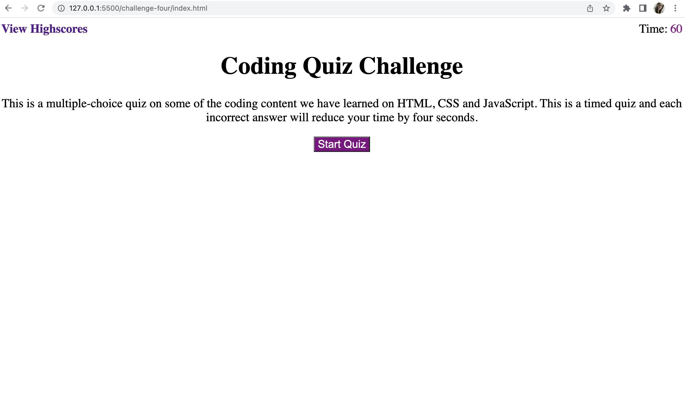

# JavaScript Quiz

## Description

In this quiz, two different HTML pages, three different javascript pages, and a css styling page are all integrated to deploy a quiz testing on JavaScript content. Building this webpage was a homework assignment designed to help practice JavaScript code and building a webpage from scratch. I learned how to apply the functions of JavaScript to create a webpage the user can interact with. 

## Installation

N/A

## Usage

The screenshot below displays the deployed quiz page. There is also a link provided that directs you to the quiz. In order to use the quiz you just follow the prompts and press the buttons to start the page, select the answers for the questions and then submit your initials with your score. Once you submit your initials you will be re-directed to a quiz displaying all of your scores where you can either clear your scores or return to the quiz. There are some errors in my code as I could not get my webpage fully functioning. 

[Quiz Link](https://jalmand2.github.io/challenge-four/)

## Credits

N/A

## License

N/A

